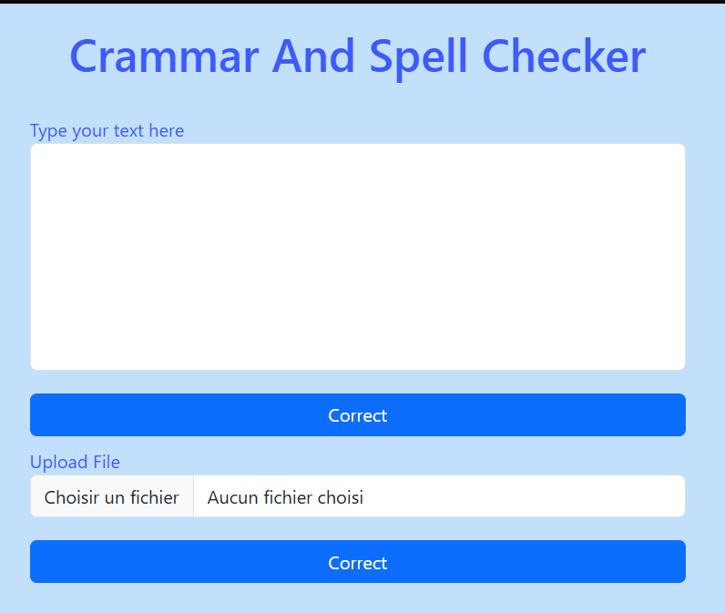

Grammar and Spell Checker App

A web application that detects and corrects spelling and grammar mistakes in English text using NLP models.

## 🚀 Features

- 📝 Spell checking and correction
- 📚 Grammar correction
- 🧠 NLP-powered suggestions (spaCy, LanguageTool, GingerIt, or Transformers)
- 🌐 Simple web interface 
- 📤 Text input and correction in real-time
- 
